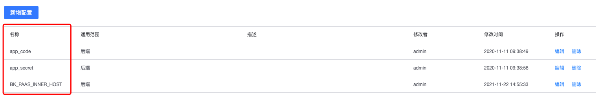

# 蓝盾容器监控(ServiceMonitor)插件

下发 prometheus servicemonitor 到指定 BCS 集群中

## 依赖项
- bk-bcs-saas 包
- bk-bcs 包

## 配置变量

- app_code: 蓝鲸App的app_code
- app_secret: 蓝鲸App的secret
- BK_PAAS_INNER_HOST: 蓝鲸内部域名地址

